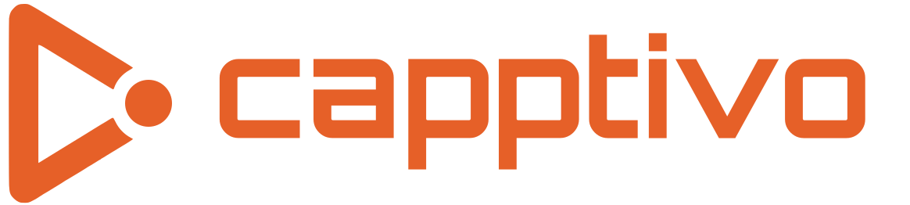
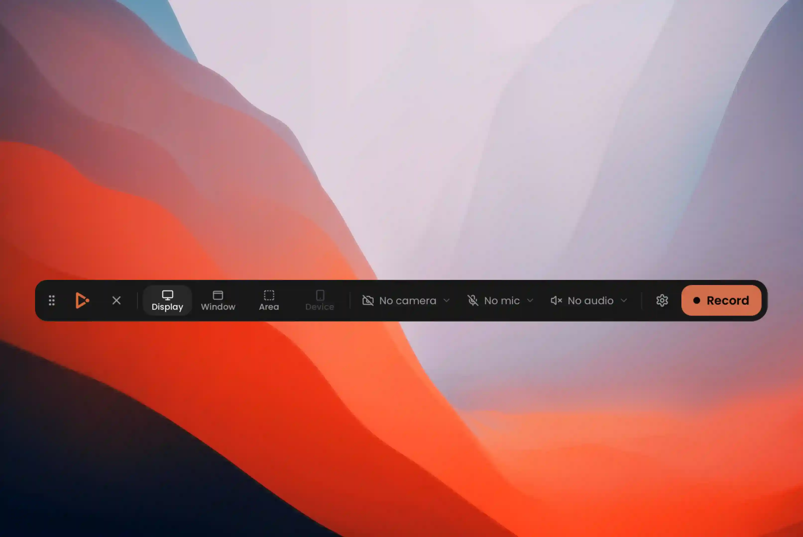

<p align="center">
  
</p>

<p align="center">
  <strong>Give your demos the spotlight they deserve
</strong>
</p>

<p align="center">
  
  
  
  
  
  
</p>

<p>
  Capptivo is your free, open-source alternative to Screen Studio and Cursorful. Create stunning screen recordings in seconds, not hours. Smart follow-cursor zoom, click-based auto zooms, editor presets, and on-device captions, your demos practically make themselves.
</p>

<p> Capptivo isn't a clone of Screen Studio, it's a tool I built for myself, with every feature designed around my own needs. Now I'm open-sourcing it under the <strong>GNU Affero GPL v3 or later</strong> so anyone can use, improve, and customize it — and keep those improvements free.

No more paying $29/month for video editing software. I hope you enjoy it, and contributions are always welcome. </p>

<p align="center">
  <a href="#download">Download</a>
  ·
  <a href="#quick-start">Quick start</a>
  ·
  <a href="#features">Features</a>
  ·
  <a href="#architecture">Architecture</a>
  ·
  <a href="#development">Development</a>
  ·
  <a href="#license">License</a>
</p>

---


https://github.com/user-attachments/assets/246054fe-8604-4ea0-ae7b-701eaafc25bf


---

## Download

Installers are published on the
[GitHub Releases](https://github.com/SECHAK-AG/capptivo/releases) page
([latest](https://github.com/SECHAK-AG/capptivo/releases/latest)).

| Platform            | What to grab                                               |
| ------------------- | ---------------------------------------------------------- |
| macOS Apple Silicon | `aarch64` / `aarch64-apple-darwin` `.dmg` or `.app.tar.gz` |
| macOS Intel         | `x64` / `x86_64` `.dmg` or `.app.tar.gz`                   |
| Windows             | `.msi` or `*-setup.exe`                                    |
| Linux               | `.deb` / `.AppImage` / `.rpm`                              |

macOS builds are currently **unsigned**. On first launch: right-click → **Open**,
or allow Capptivo under System Settings → Privacy & Security. Grant **Screen
Recording** when prompted, then relaunch.

Captions need a system [whisper.cpp](https://github.com/ggerganov/whisper.cpp)
`whisper-cli` binary; the app downloads the model weights on first use.

### Maintainers: cutting a release

1. Bump `version` in `package.json`, `src-tauri/tauri.conf.json`, and
   `src-tauri/Cargo.toml` (keep them identical).
2. Commit, then tag and push:

```bash
git tag v0.1.0
git push origin main
git push origin v0.1.0
```

3. The **Release** workflow builds macOS / Windows / Linux and opens a **draft**
   GitHub Release with the installers. Review assets → Publish.

---

## Platforms

Capptivo runs on:

- **macOS** 13.0+
- **Windows** 10 build 1903+ (May 2019 Update)
- **Linux** on modern distros (X11 and Wayland)

Platform notes:

- **macOS** captures through native **ScreenCaptureKit** with **VideoToolbox** hardware
  H.264 encoding; system audio comes from a companion SCK stream.
- **Windows** captures through native **Windows.Graphics.Capture**, with hardware
  encoding probed per machine (NVENC / QuickSync / AMF / Media Foundation) and
  system audio via **WASAPI loopback**.
- **Linux** captures through **xdg-desktop-portal + PipeWire** — the screen/window is
  picked in the system dialog. System audio comes from the PulseAudio/PipeWire
  monitor. Cursor effects (replay, zoom-follow) work on X11 sessions; on Wayland
  the cursor is embedded in the recording instead, and area selection isn't
  available yet.

---

## Quick start

```bash
pnpm install
pnpm tauri dev
```

Requires **Rust**, **Node**, and **pnpm**. FFmpeg is fetched automatically as a
per-platform sidecar on first dev/build (`scripts/fetch-ffmpeg.mjs`).

macOS: grant Screen Recording in System Settings on first launch, then relaunch.  
Open the recorder with **⌥⇧R** (**Alt+Shift+R** on Windows/Linux), or click the tray icon.

---

## Features

### Recording

- Menubar recorder with global hotkey (**⌥⇧R**)
- Capture display, window, or custom area (with live frame guide)
- Face-cam overlay while recording
- Microphone capture (device picker)
- System audio capture
- Language switch (English / Français)
- Countdown before start
- Pause / resume
- On-screen annotations while recording
- Native pipeline per OS (ScreenCaptureKit / Windows.Graphics.Capture / PipeWire) → hardware H.264 → crash-safe fragmented MP4
- 60 Hz cursor + click track saved with the project (`cursor.json`)




### Annotations

Draw on top of the screen while recording — floating toolbar, click-through when idle.

- Select tool (pass clicks through to the desktop)
- Pen and highlighter
- Eraser
- Shapes: rectangle, ellipse, line, arrow
- Text
- Color palette + custom picker
- Brush size
- Undo / redo / clear all
- Draggable toolbar; Escape peels panels then closes


### Zoom & motion

- Zoom fragments on the timeline (add with **Z** or Add fragment)
- **Auto-suggest zooms** from clicks when you open a fresh recording (or Add fragment → Suggest zooms)
- Follow-cursor zoom (pans with the pointer)
- Fixed zoom regions (drag / resize the frame)
- Scope: recording only or full scene (background included)
- Scale, pan smoothness, ease in / ease out
- Shrink background padding during zoom
- Shrink face-cam during zoom (size at peak zoom)
- Automatic motion between fragments


### Cursor

- Show / hide composited cursor
- Styles: macOS, Tahoe, Tahoe inverted, Minimal
- Cursor size
- Motion blur
- Click bounce + bounce speed
- Cursor sway


### Look & composition

- Backgrounds: image presets, gradients, solid colors, or upload your own
- Custom gradient angle / colors
- **Named editor presets** — save / apply look, face cam, cursor, captions, and export settings
- Screen content crop (hide chrome / clutter)
- Video padding
- Recording corner radius
- Recording shadow
- Background blur
- Background darkness


### Face cam

- Round or rectangular PiP
- Mirror webcam
- Corner position + margin from the frame edge
- Size / width / height
- Roundness (rectangular)
- Shadow intensity
- Crop face cam
- Layout that stays in sync with zoom (optional shrink during zoom)

### Captions

- On-device speech-to-text (Whisper via whisper.cpp)
- Downloadable model, no cloud required
- Generate, style, and burn captions into preview + export

### Timeline

- Scrub and play the composition
- Zoom fragments (add, suggest from clicks, select, resize, split, delete)
- Trim gaps (add with **T**)
- Undo / redo
- Timeline zoom (auto / manual)
- Reset fragments

### Export

- Formats: MP4, WebM, GIF
- Resolution presets (low → original)
- Encoding quality / GIF color quality
- Frame rate (24 / 30 / 60)
- Optional voice enhancement (podcast)
- Progress UI, save dialog, notification + reveal in Finder / Explorer / file manager


### Local-first

- Projects stored in the OS app-data directory (Application Support / AppData / XDG)
- In-app recordings library
- Rename projects
- No account required to record or edit
- English / French UI

---

## Architecture

```
Capture  →  bounded frame channel  →  FFmpeg / VideoToolbox  →  screen.mp4
Cursor   →  cursor.json
UI       →  typed IPC projection of Rust state
Editor   →  media:// (HTTP Range) + canvas compositor → export
```

Rust owns capture, encoding, and storage. The React shell is presentation only — domain modules never import `tauri::*`.

```
src-tauri/src/
├── recorder/     # CaptureBackend → encoder (no Tauri)
├── cursor/       # 60 Hz pointer tracker (CoreGraphics / Win32 / X11)
├── project/      # local store + schema
├── commands/     # thin IPC adapters
└── …             # tray, windows, media protocol
```

---

## Development

```bash
pnpm tauri dev                 # app + Vite
cd src-tauri && cargo test     # pipeline tests (needs ffmpeg)
cargo check --no-default-features
```

CI runs frontend typecheck and `cargo check` / `cargo test --no-default-features`
on every PR. Tagged releases (`v*`) build installers via `.github/workflows/release.yml`.

---

## License

Copyright (C) 2026 idboussadel

Capptivo Desktop is free software: you can redistribute it and/or modify it
under the terms of the [GNU Affero General Public License](LICENSE) as
published by the Free Software Foundation, either version 3 of the License,
or (at your option) any later version.

This program is distributed in the hope that it will be useful, but
**WITHOUT ANY WARRANTY**; without even the implied warranty of
MERCHANTABILITY or FITNESS FOR A PARTICULAR PURPOSE. See the GNU Affero
General Public License for more details.

You should have received a copy of the GNU Affero General Public License
along with this program. If not, see <https://www.gnu.org/licenses/>.

If you modify Capptivo and run a modified version as a network service
(for example a hosted editor or API), AGPL §13 requires that you offer
users of that service the Corresponding Source of your modified version.

Bundled and downloaded third-party components (notably the FFmpeg sidecars)
have their own licenses — see [THIRD_PARTY_NOTICES.md](THIRD_PARTY_NOTICES.md).

By contributing, you agree that your contributions are licensed under the
same terms (`AGPL-3.0-or-later`).
